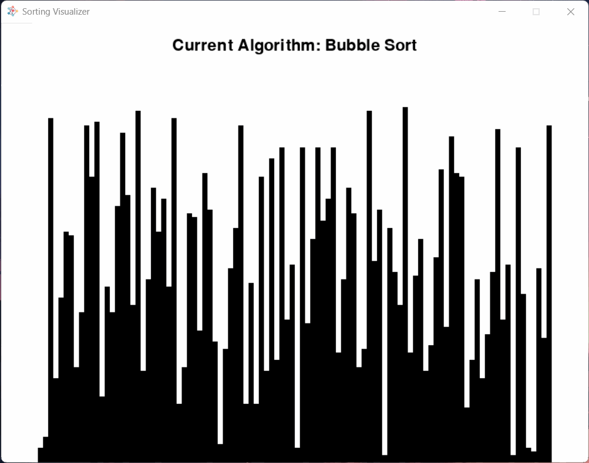

# Sorting Visualizer

A simple sorting visualizer made with Python!

## Usage

To get started, run `start.bat`. No further action is required, but make sure you fulfil the prerequisites written below! To setup the development environment, run `setup.bat` which will create a Python virtual environment and install all required dependencies automatically.

### Prerequisites

- [Python](https://python.org) 3.10+

### Keymap

- <kbd>SPACE</kbd> - Start or stop sorting
- <kbd>R</kbd> - Resets list
- <kbd>1</kbd> - Set algorithm to Bubble Sort
- <kbd>2</kbd> - Set algorithm to Insertion Sort
- <kbd>3</kbd> - Set algorithm to Selection Sort
- <kbd>4</kbd> - Set algorithm to Heap Sort

## Credits

- **Icon** by [Becris](https://flaticon.com/free-icon/neural_2103633)

## License

Distributed under the MIT License. See [LICENSE](LICENSE) for more information.