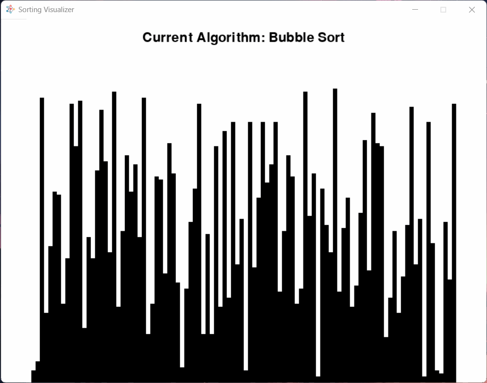

# Sorting Visualizer

A simple sorting visualizer made with Python!

## Keymap

- <kbd>SPACE</kbd> - Start or stop sorting
- <kbd>R</kbd> - Randomizes list
- <kbd>1</kbd> - Set algorithm to Bubble Sort
- <kbd>2</kbd> - Set algorithm to Insertion Sort
- <kbd>3</kbd> - Set algorithm to Selection Sort
- <kbd>4</kbd> - Set algorithm to Heap Sort

## License

Distributed under the MIT License. See [LICENSE](LICENSE) for more information.
