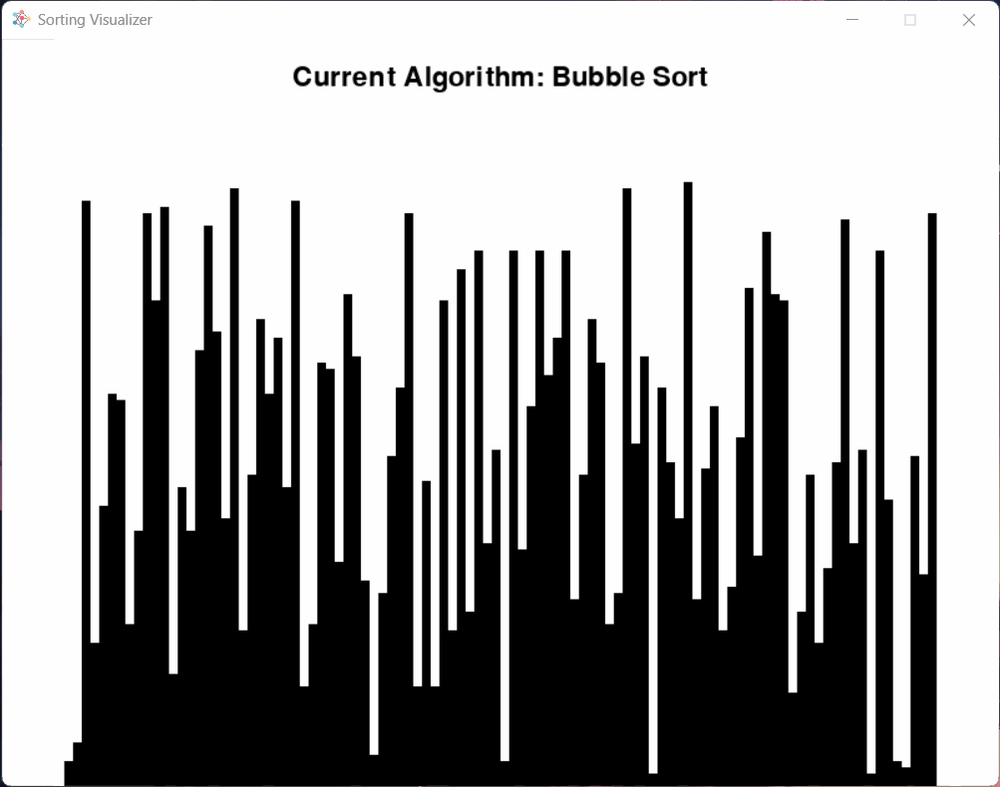

# Sortinator

A simple sorting visualizer made with Python!

## Keymap

- <kbd>SPACE</kbd> - Start or stop sorting
- <kbd>R</kbd> - Randomizes list
- <kbd>1</kbd> - Set algorithm to Bubble Sort
- <kbd>2</kbd> - Set algorithm to Insertion Sort
- <kbd>3</kbd> - Set algorithm to Selection Sort
- <kbd>4</kbd> - Set algorithm to Heap Sort
- <kbd>5</kbd> - Set algorithm to Merge Sort
- <kbd>6</kbd> - Set algorithm to Quick Sort
- <kbd>7</kbd> - Set algorithm to Shell Sort

## License

Distributed under the MIT License. See [LICENSE](LICENSE) for more information.
